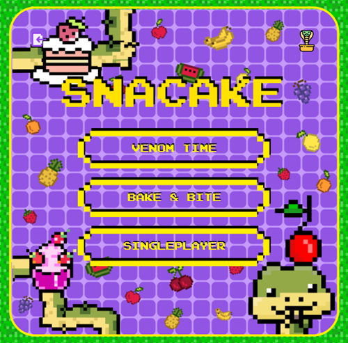
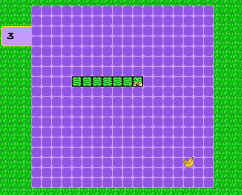
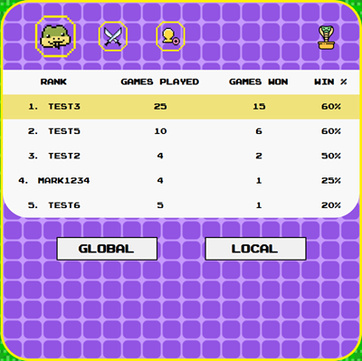
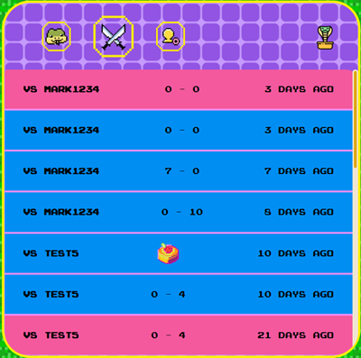
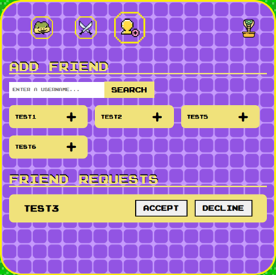

# SNACAKE
SNACAKE is 1vs1 web based multiplayer game created in Clojure. Everything in this project is public and for more techinical details please visit the following:

- [Client side](https://github.com/Suicidal-Cat/clojure-snake-game/tree/master/client)
- [Server side](https://github.com/Suicidal-Cat/clojure-snake-game/tree/master/server)

## Gameplay
There are 3 modes:
1. **Venom time** - both players have two minutes to collect as much food as possible

2. **Bake&Bite** - the goal is to be the first snake to collect all the ingredients to make a cake and win the game

3. **Singleplayer** - endless mode, enables user to practice as much he wants

## Controls
The controls are as simple as they should be. Use the **arrow keys** on your keyboard to move the snake in different directions.

## Additional Options
**Leaderboard** – each user can see their rank against the top 20 players and their friends.

**Match History** - shows the latest 20 matches the user has played.

**Friends** - allows user to add new friends
